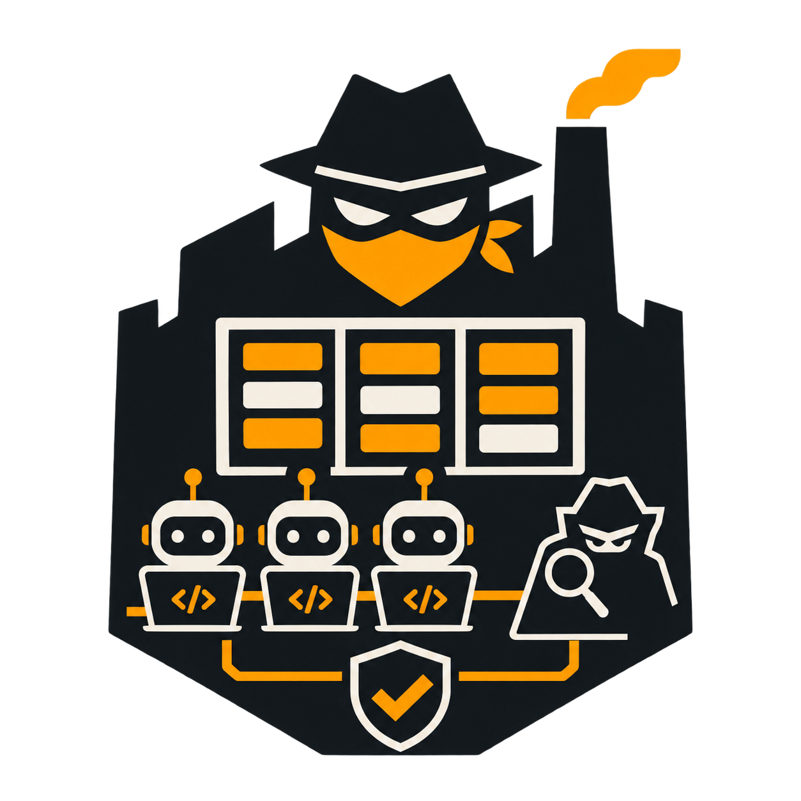

# bandit

<p align="center">
  
</p>

**The agent factory.** A dark factory where AI coding agents execute work on a kanban board, an adversarial critic enforces quality, and every claim is backed by verification evidence — not vibes.

```
   ┌─────────────────────────────────────────────────┐
   │                    THE LOOP                     │
   │                                                 │
   │   board ──▶ master ──▶ actor ──▶ verify gate    │
   │    ▲                                   │        │
   │    │                                   ▼        │
   │    └────────────────────────── critic ◀────────┘
   │         verdict: pass / fail / bypass           │
   └─────────────────────────────────────────────────┘
```

> **A serf is a folder. A card is a folder. Events are the truth. Harnesses are adapters.**

bandit coordinates multiple AI coding harnesses (opencode, Claude Code, Codex, pi…) as workers on a shared board, measures whether their work moves the needle, and governs its own confidence about what works. It is the third generation of the serf idea — proven across years of daily production use.

---

## Why

Agent harnesses are powerful but unmanaged. You babysit one session at a time, paste context by hand, and trust output that was never verified. bandit flips that:

- **Cards instead of conversations.** Work is a kanban card with acceptance criteria, not a chat transcript.
- **Verification instead of vibes.** Every actor must report a `VERIFICATION_COMMAND` and its exit code. Green or it didn't happen.
- **A critic with teeth.** A second adversarial agent evaluates every result against the card. Plumbing failures retry the *critic*, never the actor.
- **Events are the truth.** Append-only JSONL; the board is a projection. Replay repairs a corrupted board — no state to corrupt that isn't reconstructible.
- **Bounded autonomy.** Convergence rounds (default 3), budget hard-stops, stealable locks, stall detection. A hung agent is killed, not waited on.

## Install

```bash
git clone https://github.com/wisbech/bandit.git
cd bandit
bun install          # bun is the only dependency
ln -sf $(pwd)/bin/bandit.js /opt/homebrew/bin/bandit   # or add ./bin to PATH
```

Requirements: [Bun](https://bun.sh) ≥ 1.4, and at least one supported coding-agent CLI.

## Quick start

```bash
cd your-project
bandit .             # init + start — interactive picker (agent, model, visibility)
```

That opens the factory: it scaffolds `.bandit/`, asks which harness to run, which model, and which serfs you want to *see* live — then watches the board forever.

Add work:

```bash
bandit task "fix the flaky login test" \
  --accept "pytest tests/test_login.py passes 3x in a row"
```

Watch it run:

```bash
bandit watch         # live dashboard: agents, cards in flight, board, events
bandit events        # the event log — the truth
bandit board         # the kanban
```

## The actor–critic loop

Every card runs a bounded convergence dialogue refereed by the confidence ledger:

1. **Actor pulls.** Executes the card, edits real files, reports a verification command.
2. **Gate.** The verification command must exit 0. Red → critic *triages* (fixable by skill, or missing prerequisite?).
3. **Critic evaluates.** Adversarially, with evidence demanded. Its verdicts persist in its own folder — a track record, not a vibe.
4. **Converged?** Green + (pass, or plumbing-bypass, or low-confidence fail) → done. Otherwise: next round, with the critic's findings as feedback.
5. **Same missing capability twice?** The factory spawns a specialist child serf for that capability.
6. **No convergence after 3 rounds?** Card escalates to review. Nothing silently disappears.

Non-trivial pipelines get a **plan critique** first — the critic rejects bad plans before the actor burns a single execution token.

## Harnesses — any agent, one interface

`.bandit/harnesses/*.json` — one declarative profile per harness. The factory owns identity and state; the harness owns its native session.

```json
{
  "name": "acp",
  "command": "npx",
  "args": ["--yes", "@agentclientprotocol/claude-agent-acp"],
  "protocol": "acp",
  "gateway": { "baseUrl": "http://localhost:11434", "headers": { "x-api-key": "ollama" } },
  "model": "glm-5.3-flash:cloud"
}
```

```bash
bandit harnesses                        # list installed profiles (● = active)
bandit harnesses add acp-pi npx --yes @some-pi-acp-adapter --protocol acp
bandit start --transport acp            # switch factories, not workflows
```

Four protocols, one factory:

| Protocol | How it runs | Good for |
|---|---|---|
| `headless` | spawn CLI with prompt on argv, gate on exit | opencode/claude/codex/pi one-shots |
| `acp` | [Agent Client Protocol](https://agentclientprotocol.com) over stdio — Claude Code (via adapter), Codex, OMP, pi | the universal spoke; gateway auth routes to **any** Anthropic-protocol backend — local ollama, hosted gateways, or any provider speaking the Anthropic API shape |
| `herdr` | live TUI in a pane | watching + steering mid-run |
| `uhp` | HTTP `/v1/responses` | hosted endpoints |

The ACP adapter speaks the [harness-remote](https://github.com/giuliastro/harness-remote) shape too — remote control planes are a profile, not a fork.

**Any LLM works with every agent.** Models are normalized to `provider/id` and routed per harness: the interactive picker lists your live ollama catalog, the ACP gateway accepts any Anthropic-protocol endpoint (self-hosted or hosted), and `uhp` reaches any `/v1/responses` host — pi, opencode and claude all take the same model spec. Local or cloud, open-weights or proprietary: swap the model, keep the factory.

## Visibility is a launch choice

```bash
bandit start --visible none            # headless — watch via `bandit watch`
bandit start --visible actor           # just the actor
bandit start --visible actor,critic    # the GAN, live
bandit start --visible all             # every serf in a herdr pane
```

Pick interactively at launch, persist it in `config.json`, or override per run. Only *missing* panes open — rejoining a live factory doesn't duplicate workers.

## Chat with your serfs

```bash
bandit chat critic                  # walk into the critic's pane and talk
bandit chat actor --agent claude    # chat via a different harness
```

Serfs live in the loop while it runs. You type to them mid-run; they answer in their pane. The human joins the factory, not a separate dashboard.

## Confidence, measured

- **Bucket-brigade ledger** during bootstrap: claims corroborated by independent measures gain standing; established = probability, not a feeling.
- **Thompson-sampling governor** when instruments converge: ≥1 corroborated measure + ≥2 levers with real pull history → posteriors replace hunches. `bandit bandit` shows the posteriors.
- **Levers and measures**: a goal is discovered, not decreed. Levers are hypotheses; measures are external-source instruments; pulls update the ledger.

## The refiner — the factory improves itself

After the board drains, failure signatures trigger a refiner pass: it reads the event log, proposes edits to serf prompts/memory/structure **with evidence**, snapshots first, applies, and every pass is reversible (`bandit refine --rollback <ts>`). Two consecutive `critic.repair` events, for example, trigger a transport-plumbing lesson written into the critic's memory — by the factory, about itself.

## Commands

```
bandit init            scaffold .bandit/ in the current project
bandit task            add a card: bandit task "title" --accept "criterion"
bandit board           show the kanban
bandit start           run the factory loop (--agent/--model/--visible/--transport)
bandit watch           live dashboard — see agents working
bandit events          show the event log (the truth)
bandit chat            walk into a serf's pane and talk
bandit panes           open/close visible serf panes (herdr)
bandit harnesses       list/add harness adapter profiles
bandit confidence      the confidence ledger
bandit bandit          the Thompson-sampling governor
bandit refine          self-improvement pass (--force, --rollback, --history)
bandit migrate         fold a v2 .serf/ into .bandit/
```

## Invariants

1. One factory per project root per node.
2. Events are append-only; every state change is reconstructible.
3. Plumbing failures never punish the worker.
4. Budget is a hard stop; counters survive restarts.
5. Never invent a control the harness didn't advertise.
6. If a feature can't be explained as "a file a serf reads or writes," it doesn't go in.

## Architecture in one screen

```
.bandit/
├── plan.md               # mission + current direction
├── config.json           # agent/model/transport/visibility
├── harnesses/            # adapter profiles (the universal spoke)
├── board/
│   ├── backlog/          # cards waiting
│   ├── in-progress/      # cards being executed (outputs land inside)
│   ├── review/           # escalations (critic verdicts travel with the card)
│   └── done/
├── serfs/
│   ├── actor/            # prompt.md, serf.md, journal/, outputs/, memory/, children/
│   ├── critic/           # verdicts persist here — its track record
│   └── master/
├── events/               # append-only JSONL — the truth
└── goal/                 # confidence ledger + bandit posteriors
```

Recursion is structural: a factory spawns child factories the way serfs spawn children — folders with lineage. Delegation flows down; established truth flows up. A project grows into a department grows into a company by mechanism first; the org chart is an emergent property of the tree.

## Documentation

| Doc | What it covers |
|---|---|
| [Architecture](docs/architecture.md) | the loop, folders, cards, events, pipelines, the critic, confidence, budgets, recursion |
| [Harnesses](docs/harnesses.md) | adapter profiles, the four protocols, ACP lifecycle, gateway auth (any LLM backend), model routing |
| [CLI reference](docs/cli.md) | every command with flags and examples |

## Tests

55 tests, one command, no mocks of convenience — real stub transports, real card folders:

```bash
bun test
```

## Status

v0.1 — the loop, the critic, the ledger, the adapters, and the panes are production-hardened on real work (an EMBA capstone strategy report was just written by a W1–W4 actor crew, failed adversarial review, and a FIX-1 repair pass — all autonomous). Recursive factory tree and remote control-plane profiles are next.

## License

MIT